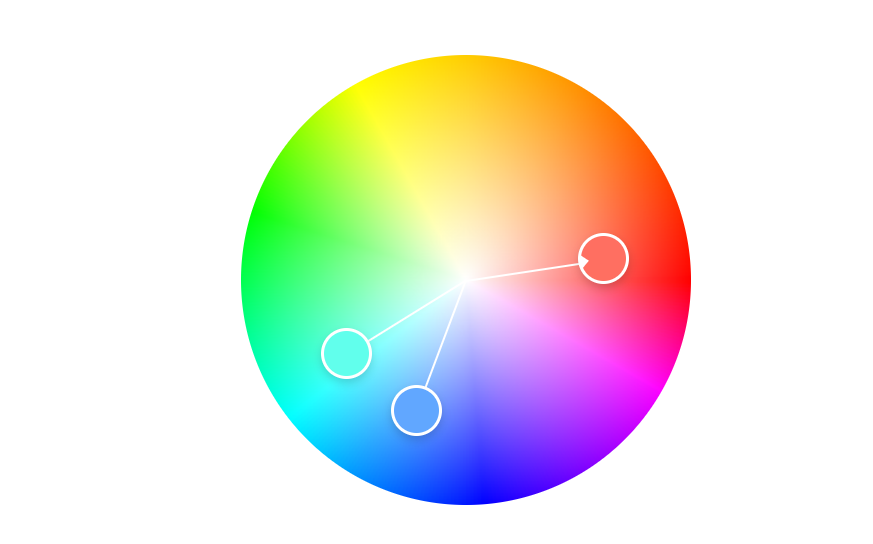
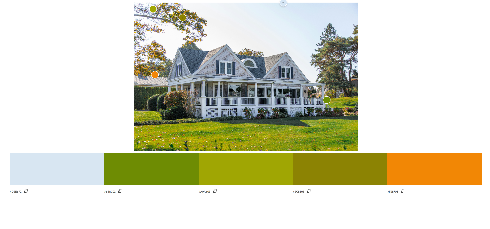
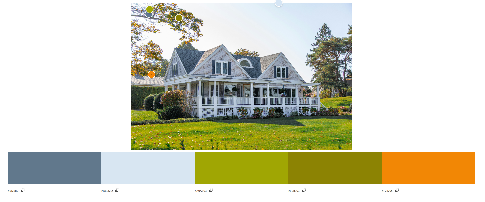
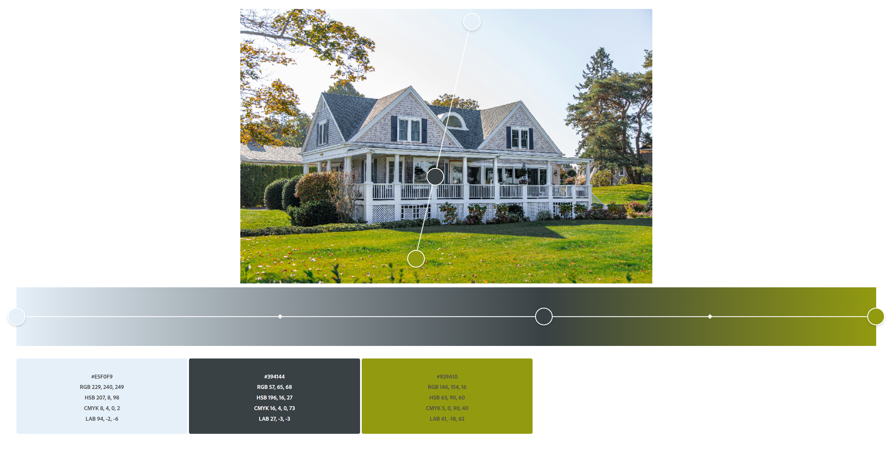
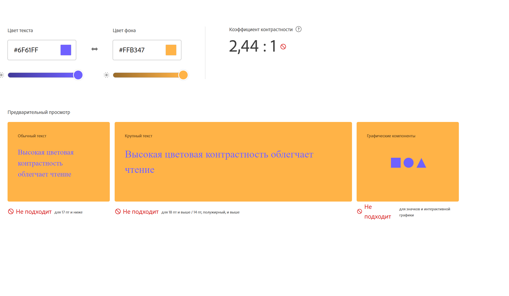
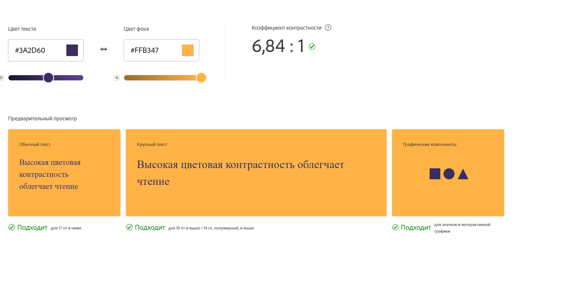

# Робота з Колірним Колесом (Color Wheel)

## Базовий колір:

**#FF6F61** — теплий коралово-червоний

---

## 1. Analogous (Аналогова гармонія)

- Палітра: `#FF6F61`, `#FF8A5C`, `#FFB347`
- **Логіка**: Кольори, що розташовані поруч на колірному колесі (схожі по відтінку).
- **Емоційний ефект**: Затишок, природність, спокій. Добре підходить для органічних і теплих композицій.

---

## 2. Monochromatic (Монохромна гармонія)

- Палітра: `#FF6F61`, `#FF998D`, `#CC574C`, `#993F39`
- **Логіка**: Один колір з варіаціями яскравості, насиченості, світлоти.
- **Емоційний ефект**: Стриманість, чистота стилю, професійний вигляд.

---

## 3. Triad (Тріадна гармонія)

- Палітра: `#FF6F61`, `#61FF6F`, `#6F61FF`
- **Логіка**: Три кольори на однаковій відстані на колірному колесі (120°).
- **Емоційний ефект**: Баланс контрасту й гармонії. Візуально динамічна палітра.

---

## 4. Complementary (Комплементарна гармонія)

- Палітра: `#FF6F61`, `#61D9FF`
- **Логіка**: Протилежні кольори на колірному колесі.
- **Емоційний ефект**: Напруга, збудження, акцент. Добре для CTA та емоційної взаємодії.

---

## 5. Split Complementary (Розділена комплементарна гармонія)

- Палітра: `#FF6F61`, `#61FFEC`, `#61A7FF`
- **Логіка**: Базовий колір + два сусідні до комплементарного.
- **Емоційний ефект**: М’який контраст, зберігає енергію без надмірного збудження.

---

## 6. Square (Квадратна гармонія)

- Палітра: `#FF6F61`, `#6FFF61`, `#61A7FF`, `#A761FF`
- **Логіка**: Чотири кольори, рівновіддалені по 90° на колесі.
- **Емоційний ефект**: Живий, сильний візуальний ефект, баланс теплого й холодного.

---

## 7. Custom (Користувацька палітра)

- Палітра: `#FF6F61`, `#F7C59F`, `#EEF5DB`, `#A3C4BC`, `#77628C`
- **Логіка**: Створена на основі інтуїції, естетики та емоцій.
- **Емоційний ефект**: Витонченість, м’якість, гармонія. Ідеальна для брендингу або сучасного сайту.

# Створення палітри та градієнту на основі зображення

---

## 2. Створення палітри (Extract Theme)

### Варіант 1: **Colorful**

- Палітра: насичені, контрастні кольори — #D8E6F2, #6E8C03, #A0A603, #8C8303, #F28705.
- **Опис:** Активна, жива палітра. Підходить для творчих, емоційних сайтів або ігрових додатків.

---

### Варіант 2: **Muted**

- Палітра: приглушені, м’які кольори — #61788C, #D8E6F2, #D8E6F2, #8C8303, #F28705.
- **Опис:** Спокійна, витримана палітра. Ідеальна для інтерфейсів, що потребують зосередженості (наприклад, банківський застосунок, щоденник, медитація).

---

### Висновок:

**Muted-палітра** більше підходить для інтерфейсу додатку.

- **Чому?**
  - Менше візуального шуму.
  - Краще читається текст на фоні.
  - Не перевантажує користувача — сприяє UX-дизайну.

---

## 3. Створення градієнту (Extract Gradient)

- Gradient Stops = **3**
- Отримані кольори:

  - #E5F0F9
  - #394144
  - #929A10

# 4. Аналіз контрасту (Accessibility Tools)

## Вибрані кольори:

- **Фон (background)**: `#FFB347` (світло-помаранчевий з палітри Analogous)
- **Текст (text)**: `#6F61FF` (фіолетовий з палітри Triad)

---

## Результат перевірки контрасту:

| Тест                      | Результат    |
| ------------------------- | ------------ |
| Контрастне співвідношення | **2.44 : 1** |
| AA для звичайного тексту  | Не проходить |
| AA для великого тексту    | Не проходить |
| AAA для звичайного тексту | Не проходить |
| AAA для великого тексту   | Не проходить |

---

## 🛠 Рекомендація:

Для досягнення мінімального рівня AA (4.5:1 для звичайного тексту) була запропонована зміна кольору тексту.

### **Коригована пара:**

- **Фон**: `#FFB347` (без змін)
- **Текст**: `#3A2D60` (темно-фіолетовий)

## Результат перевірки контрасту:

| Тест                      | Результат    |
| ------------------------- | ------------ |
| Контрастне співвідношення | **6,84 : 1** |
| AA для звичайного тексту  | Проходить    |
| AA для великого тексту    | Проходить    |
| AAA для звичайного тексту | Проходить    |
| AAA для великого тексту   | Проходить    |

---

## Висновок:

Контрастність кольорів критично важлива для доступності. Початкова пара виглядала яскраво, але не була читабельною. Після корекції — текст чіткий і відповідає всім стандартам WCAG.
